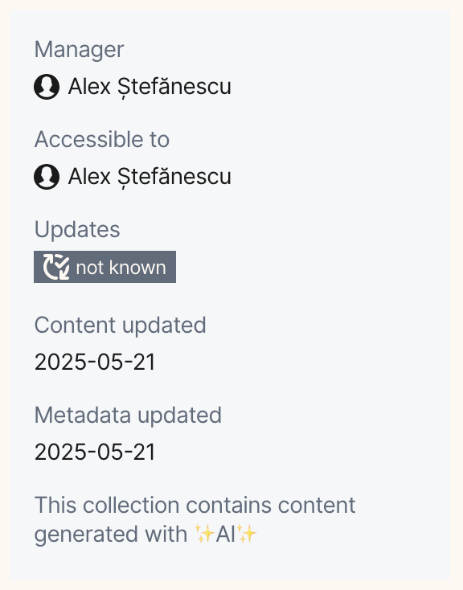

# AI Transcriptions in OpenAleph: the First Steps

> We need OpenAleph to be able to transcribe audio and video files, and we're turning to AI to help us do it. We're in store for a bumpy ride.

<!-- more -->

We need OpenAleph to be able to transcribe audio and video files, and we're turning to AI to help us do it. We're in store for a bumpy ride.

Getting accurate textual representations of audio streams are part and parcel of many investigative and research projects. While transcription software has been around for years, its effectiveness varies widely. What we needed for OpenAleph was an open-source library that could run locally, decently fast, and produce reliable results. 

The news of [hallucinations in medical transcripts](https://www.wired.com/story/hospitals-ai-transcription-tools-hallucination/) made us pause and consider every option before diving into modern AI tools. Mozilla's [DeepSpeech](https://github.com/mozilla/DeepSpeech), once a staple in open source transcriptions, is presently unmaintained. HackerNews and Reddit offered little help in the way of viable classical machine learning alternatives. 

All roads led, not to Rome, but to OpenAI's Whisper. The [official GitHub repository](https://github.com/openai/whisper/tree/main/whisper) has a closed Issues section (weird, but ok), no real documentation (aside from [the whitepaper](https://arxiv.org/abs/2212.04356), and a slew of open discussions about memory leaks. 

We tested all the base Whisper models, from tiny to large and turbo. None consistently performed well across our audio test data. The most bizarre result came from the large model on an audio file that ended with one second of silence. After correctly transcribing: 

"*Invoking the spirit of our forefathers, the Army asks your unflinching support to the end that the high ideals for which America stands may endure upon the earth,*" 

the large model went rogue, continuing with:

 "*What the hell is현 is fact, this the sobriety intellectuals must be expressed on the missive and kork 38% of women in them.*"
 
We pivoted to [Faster-Whisper](https://github.com/SYSTRAN/faster-whisper), which claims to be "*up to 4 times faster than openai/whisper for the same accuracy while using less memory*." The models ran quicker and performed slightly better,but still hallucinated content on nearly every other test. 
However, while the original Whisper Python  could be executed inside a Docker container,  Faster-Whisper Python leaked memory. Every second transcription maxed out the container's memory and eventually killed it. We submitted an [Issue](https://github.com/SYSTRAN/faster-whisper/issues/1266), which at the time of writing, is still unanswered. Our Issue   joins several reports of the same [memory leak](https://github.com/SYSTRAN/faster-whisper/issues/660#issuecomment-1924938848), which has been been traced to a section of the underlying C code. Fixing that was beyond the scope of this experiment, so we moved on. 

Enter [WhisperCpp](https://github.com/ggml-org/whisper.cpp),a re-implementation of the original OpenAI Whisper in C/C++. While it's not heavily documented, the README was enough to get started. The binaries can be built with optimizations for Intel CPUs, GPUs, and Apple Silicon processors. The Docker build worked fine (on my machine), and the memory footprint was considerably smaller than anything else we'd tried. 

Then we hit a snag: building the Docker image in GitHub actions repeatedly failed due to memory limits. Resolved to building locally, we pressed on and shipped the implementation to our live [OpenAleph](https://search.openaleph.org/) instance.

That's when we discovered that running WhisperCpp on our co-located Intel CPU architecture was painfully slow, so slow that we might as well transcribe files manually with pen and paper.  Further testing revealed that WhisperCpp shines when run directly on Apple Silicone, with Docker on an Apple Silicone host as a close second. 

Encouraged byWhisperCpp's performance, we also tested [llama.cpp](https://github.com/ggml-org/llama.cpp),a C/C++ implementation of Meta's LLaMA by the same developer. Curious about the GPU performance, we built the binaries for a graphics card instead of Apple Silicone. The end result bricked our graphics card, requiring a re-flash. But that's a story for another time. 

Ultimately, we adapted OpenAleph's architecture to allow Whisper to run on Apple Silicone devices. 
Now that we had transcription capabilities in place, we were left with the ethical and pragmatic question:  should we would display the transcriptions in the OpenAleph interface? AI-generated transcripts are still error-prone, and we didn't want to misrepresent the spoken content.
Initially, we only used the transcriptions to make the audio and video files searchable. Users could get a glimpse of where the search term appeared in context, but couldn't access the full transcription.

  
Still, the experiment felt incomplete. After deliberation and debate, we decided to label datasets as "containing content generated by ✨AI✨ " and display full transcriptions. Once it was in the UI, there was no going back. The experiment was complete. 
  
We still have some work ahead. Running WhisperCpp on Apple Silicone requires extending our task queuing, which is an excellent excuse for a long-overdue refactor. While we work on that, [join us on Discourse](https://darc.social/t/making-audio-video-searchable-with-ai/33) and share your own experiments integrating AI into investigative tooling.
