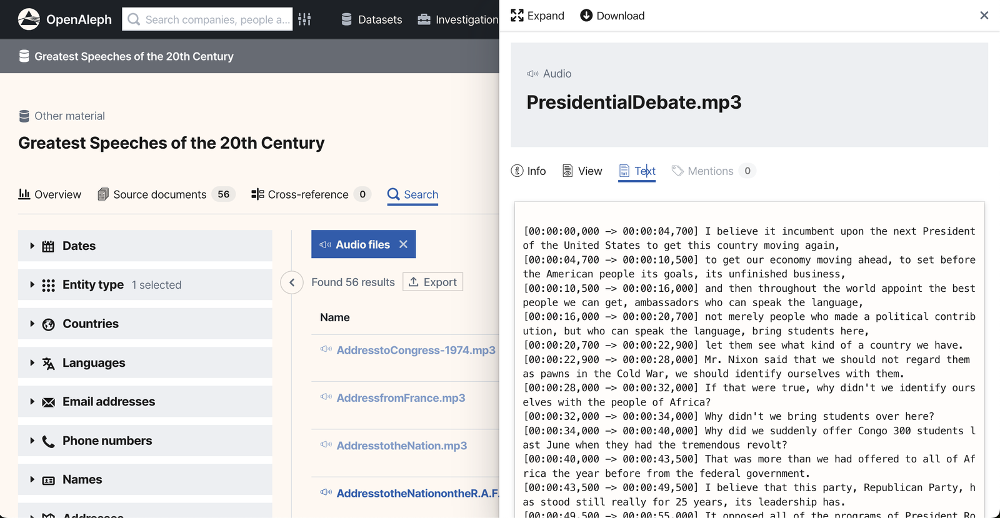

# Making Audio and Video Files Searchable

> We kept hoping that audio transcription tools would eventually deliver faithful textual representations of audio streams. We kept hoping that ✨AI✨  would solve this problem.

<!-- more -->

We're not there yet,but things are good enough now that we felt ready to experiment. 
We've built a feature for [OpenAleph](https://search.openaleph.org/) that allows users to transcribe audio and video files. By using the built-in search functionality, users can sift through the transcribed text to reveal names, keywords and phrases. 

We're using [Whisper](https://openai.com/index/whisper/), an automatic speech recognition (ASR) system created and open-sourced by OpenAI. As of early 2025, it seems to be the de-facto tool for transcription. Whisper is multi-lingual and can automatically detect the language of the audio stream. 
To guarantee the privacy of the data in OpenAleph, we implemented a local-only version of Whisper running on our own infrastructure. The audio or video files uploaded to OpenAleph will be transcribed using this local model, and no data is sent to  OpenAI's servers.

We wrote a blog post that goes into detail about [building the transcription feature](./2025-05-22-ai-transcriptions-in-openaleph-the-first-steps.md). It involved a lot of trial and error. We also reveal what we learned about the best way to run ✨AI✨, as well as the things we tried that backfired spectacularly. 

  
The transcriptions Whisper creates are not perfect. All the models we've tested, built by OpenAI, sometimes hallucinate or mis-transcribe content. This means that some transcriptions include words and phrases that didn't exist in the original audio stream. 
  
 Because Whisper is still error-prone, we faced a dilemma as we experimented with introducing it to OpenAleph. The transcription shouldn't be relied on as a faithful textual representation of the audio. At the same time, the need to search through audio and video content is growing across research and investigative projects.
  
To address this, we introduced a new piece of metadata that flags the presence of AI-generated content in a dataset. This lets us clearly signal to users that the transcriptions they are viewing should not be considered faithful representations of the audio stream. 
  

  
Going forward, we are considering building a tool that allows users to correct transcripts and mark them as verified. 
  
If you have thoughts on transcriptions or have tried building similar workflows, we'd love to [hear about your experience](https://darc.social/t/making-audio-video-searchable-with-ai/33).
