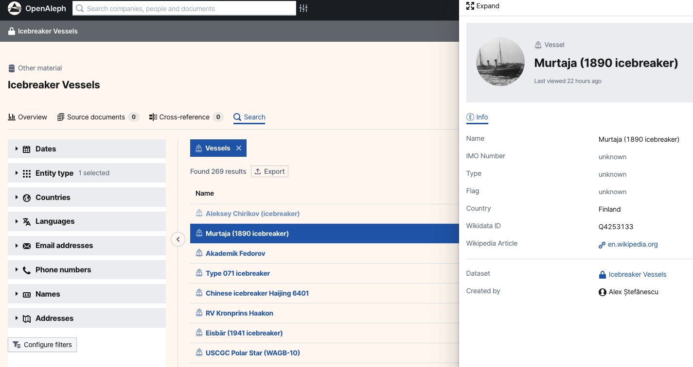

# Putting a Face to the Name

> Putting a face to the name can do wonders to jog the memory.

<!-- more -->

Ever wondered what OpenAleph would look like with a more baseball card feel? Now you don't have to. 

We've just launched a feature that pulls in images for entities. Here's how it works: it uses the [Wikidata ID](https://www.wikidata.org/wiki/Wikidata:Identifiers) to fetch images from Wikidata and display a preview image of any [Follow The Money](https://followthemoney.tech/) entity, provided the `wikidataId` property is populated.

This feature is especially useful for `Person` entities, but it's not limited to them. In the FtM schema, any entity derived from `Thing` has a `wikidataId` property and can take advantage of this new feature. 

As investigations progress, a person's profile grows richer and often becomes deeply embedded in the minds of researchers. Even years after publication, a name can trigger a wealth of memories, including details about that person's assets, actions and connections. But an image can go even further, tapping into our visual memory in a powerful way. 

Until recently, entity representation in OpenAleph didn't take full advantage of that potential. Although it was technically possible to add images to datasets, there was no way to display a `Person` entity alongside their picture. 

You can try this feature out on your locally deployed or managed OpenAleph instance by following our [step-by-step tutorial](https://github.com/dataresearchcenter/tutorials/tree/main/Tutorial%3A%20Display%20Images%20for%20Vessels). We've created a Jupyter notebook that helps you scrape a Wikipedia page of icebreaker ships and their corresponding Wikidata IDs. In this tutorial, you'll learn how to create `Vessel` entities in OpenAleph, apply the scraped Wikidata IDs as properties, and generate a dataset of icebreaker ships complete with preview images.

Try it out and let us know how it goes on our [community forum](https://darc.social/). We'd love to hear your feedback and see how you're making use of this new feature.

