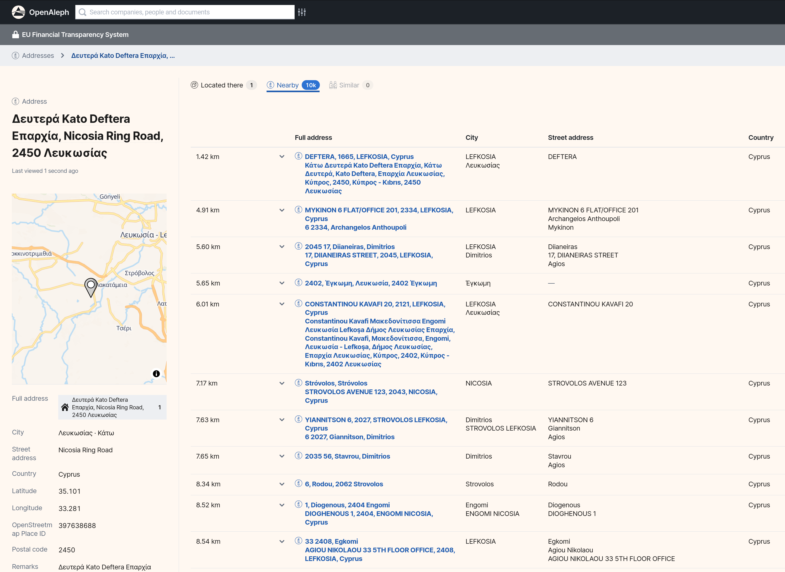
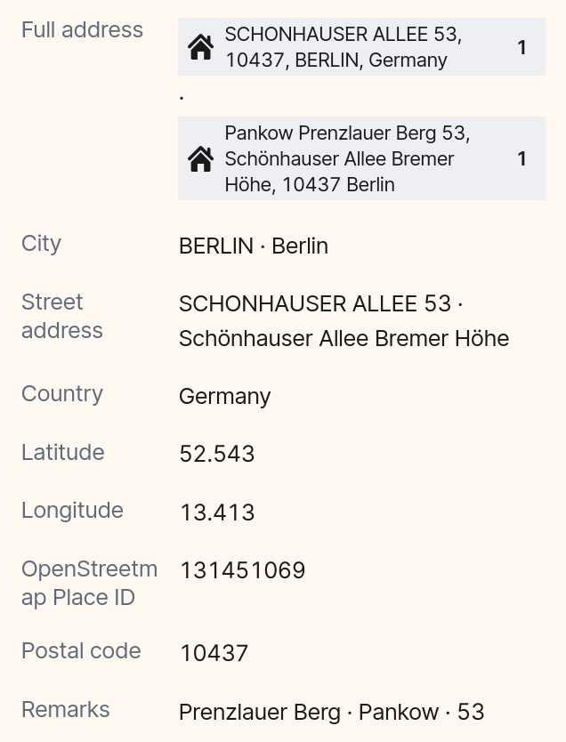

# Geocoded Addresses in OpenAleph: A New Way to Spot Connections

> The new geocoding feature in OpenAleph makes addresses a whole lot more interesting.

<!-- more -->

_The new nearby lookup in OpenAleph_{.muted}

Until now, addresses in OpenAleph were often just static pieces of text attached to an entity, like a person or company. With our new geocoding feature, these addresses become entities in their own right. That means OpenAleph can now do a lot more with them, including putting them on a map.

## What’s New?

When OpenAleph encounters an address — say, the headquarters of a company or a residential address tied to a person — it now treats that address as a standalone entity. This means we can geocode it: transform the text into a set of geographic coordinates and plot it on an interactive OpenStreetMap.

But we didn’t stop there. Alongside the primary address, OpenAleph also displays *nearby* addresses, letting you see what else is in the neighborhood. That opens up new avenues for investigation: Are there other companies at the same location? Do multiple entities share an office building or a residential block? Are there clusters of activity you might otherwise have missed?

This adds a spatial dimension to entity relationships, one that goes beyond shared names or mutual associates.

## How It Works

Let’s get a bit technical for a moment.

In many datasets, addresses are just unstructured strings, and those strings can vary wildly depending on the source. One line might read *123 Mainstr., Berlin*, another *Mainstraße 123, 10117 Berlin, Germany*. To work with these in a consistent way, we needed to break them down into their individual components (street, postal code, country, etc.) and standardize the format.

To do this, we used [**Libpostal**](https://github.com/openvenues/libpostal), an open-source machine learning library trained on global address data, to parse and extract the individual parts of each address. Then, we cleaned and normalized the results using [**rigour**](https://github.com/opensanctions/rigour), a Python library developed at [OpenSanctions](https://opensanctions.org/) that standardizes address formatting across messy datasets.

Once the address was structured and cleaned, we could geocode it, that is, convert it into geographic coordinates. For that, we used [**ftm-geocode**](https://github.com/dataresearchcenter/ftm-geocode), our own open source library, originally developed for the [FarmSubsidy.org](https://www.farmsubsidy.org/) project. **ftm-geocode** interfaces with [OpenStreetMap Nominatim](https://nominatim.openstreetmap.org/ui/search.html) or other geocoding services to pinpoint the location of each address and make it ready for mapping in OpenAleph.

_An example address from the [EU Financial Transparency System dataset](https://search.openaleph.org/datasets/63) that has been structured and geocoded:_

## Why It Matters

Investigators often search for patterns based on names, companies, or shared identifiers. But geography can tell its own story, and sometimes it’s the missing piece.

With geocoded addresses now built into OpenAleph, we’re giving you a new lens for your investigations. Whether you’re mapping a network of shell companies or trying to figure out if two entities are more closely linked than they appear, this feature helps you get there faster.

We’re excited to see how you’ll use it.
