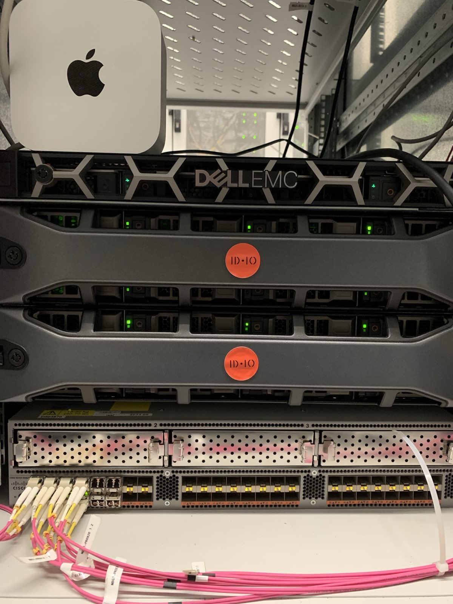

# Bringing Local AI to OpenAleph

> Because AI should be private, fast, and under your control.

<!-- more -->

At DARC, we’ve always been a little obsessed with speed, privacy, and control. The faster clients can find what they need, and the more securely we protect their data, the better.

That’s why we just added a small but mighty upgrade to our infrastructure: a Mac mini, plugged directly into our servers, running our very own local AI transcription engine.

This little box now [makes audio and video files searchable](./2025-05-22-making-audio-and-video-files-searchable.md) in OpenAleph without sending a single byte to an external cloud service.

_A glimpse into our co-location with the new tenant_{.muted}

## Why Local AI?

Modern open source AI tools like [Whisper](https://openai.com/research/whisper) are powerful, but most people use them through third-party services. That means your audio and video data leaves your infrastructure and passes through someone else’s servers. For investigative journalists, NGOs, and other sensitive-data users, that's often a deal-breaker.

By running Whisper locally on our own hardware, we:

- **Keep your data private** – files never leave our infrastructure.
- **Manage resources** – no waiting in someone else’s queue; we decide what runs now and what can wait.
- **Stay in control** – we decide how the AI is configured, optimized, and deployed.

The result is faster turnaround times, stronger privacy guarantees, and more flexibility for our future AI experiments.

## Searchable Audio and Video

With this setup, you can upload audio or video to OpenAleph and have it automatically transcribed into text. Once the transcript is in the system, it becomes fully searchable. That means you can:

- Find every mention of a name or keyword across hours of footage.
- Surface quotes or moments without manually scrubbing through files.
- Combine transcription with OpenAleph’s other search tools for deeper analysis.

AI-generated transcripts are now clearly marked with a metadata flag. They’re useful for discovery but not perfect, so you’ll always know they’re an AI-generated reference, not an exact legal transcript.

## A Platform for Future AI Features

This is not just about transcription, it's about building a foundation for more local AI capabilities in OpenAleph. Running AI on our own hardware opens the door to:

- **Translation** – Search and analyze documents in multiple languages, regardless of your search term.
- **Vector search** – Search for concepts and ideas, not just keywords.
- **Improved entity resolution** – Better match persons and companies to enhance network diagrams.

Because the AI runs locally, every future experiment benefits from the same privacy, speed, and control advantages.

## What’s Next

Now that our local AI transcription engine is live, we are excited to see how our clients put it to work. We are also exploring tools that would let users review and fact-check AI transcripts directly in OpenAleph, confirming accuracy and flagging any errors in Whisper’s output. This way, AI-generated transcripts can be elevated from a quick discovery tool to a verified, trusted research asset.

If you have been experimenting with similar workflows or have ideas for what you would like to see next, we would love to hear from you.
