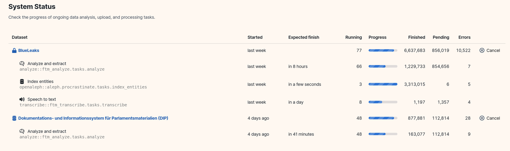

# 🎉 80 Years of The Aleph and the release of OpenAleph 5

> OpenAleph 5 is here! We made investigative search faster, clearer, and more adaptable.

<!-- more -->

_The new status screen of OpenAleph_{.muted}

On September 1, 1945, Jorge Luis Borges published [*The Aleph*](https://archive.org/download/borges-jorge-luis-book-of-sand-gold-of-the-tigers-penguin-1981/Borges%2C%20Jorge%20Luis/Aleph%20%26%20Other%20Stories%2C%201933-1969/Borges%2C%20Jorge%20Luis%20-%20Aleph%20%26%20Other%20Stories%2C%201933-1969%20%28Bantam%2C%201971%29.pdf), the story of a single point in space that contained all other points and revealed total, infinite knowledge. That idea inspired the name of Aleph, the original open-source software that OpenAleph builds on. We’ve never tried to capture infinity, but OpenAleph has always aimed for a smaller, more practical version of Borges’ vision, helping investigators search, connect, and make sense of sprawling datasets.

Today we’re releasing **OpenAleph 5**, a major update with new data discovery features, more precise search, greater transparency into how the system works, and improved handling of the wide variety of documents you rely on. We’ve also modularized the system to make it easier to adapt and customize for different use cases, whether you’re running a newsroom archive, a leak platform, or a research database.

## What’s new in OpenAleph 5

- **Discovery Dashboard:** After uploading documents into a collection, the new Discovery tab gives you an at-a-glance view of the people, companies, organizations, and locations that appear most frequently in the data, along with other names in the dataset that are closely correlated with each of them.
- **Search suggestions**: When you search for a term, OpenAleph suggests related names (people, companies etc.) from your dataset. These are the terms most often found alongside your query, helping refine searches and highlight connections you might otherwise miss.

👉 *The new [Discovery page](https://search.openaleph.org/datasets/469#mode=discovery) is available to explore in our public OpenAleph instance. Try the [search function](https://search.openaleph.org/datasets/469?cslimit=30&csq=frontex#mode=search) there to see how correlated names are surfaced.* 

- **Sharper highlights:** Occurrences of a search term in source documents are now marked more precisely and visibly. Highlights also apply to extracted mentions, not just direct search terms, making it easier to spot what matters in long texts.
- **Status transparency:** The new status page shows what OpenAleph is working on and provides time estimates for running jobs. Admins can also see exactly where upload failures occur, and in version 5.1 this visibility will be extended to all users.
- **Names across cultures**: With support from [OpenSanctions](https://www.opensanctions.org/), searches now recognize names across alphabets and cultural variations, reducing false matches and improving accuracy.
- **Fallback text extraction**: OpenAleph now uses Apache Tika to make one last attempt at extracting text from unfamiliar file types, expanding the range of documents it can process.
- **Infrastructure improvements**: A modularized codebase makes development and maintenance more straightforward, and lays the groundwork for future features.

OpenAleph 5 also continues to include features from earlier releases, such as searchable audio and video, and geocoding support.

## Why it matters

The aim of this release is straightforward: **to make search results cleaner, system behavior more transparent, and document processing more resilient**. These changes should make day-to-day investigative work smoother and more reliable.

## Looking ahead: OpenAleph 6

OpenAleph 5 is also the last release in the current line. Work is already underway on **OpenAleph 6**, which will arrive at the end of 2025. This next version will refocus the platform around its core purpose — being the best and most efficient investigative search engine possible — with new approaches to cross-referencing, shared archives, and concept-based search.

Eighty years on from Borges’ *Aleph*, we’re still chasing the same idea: a clearer view into the things that matter hidden inside the data. OpenAleph 5 is a step forward on that path, and we’re looking forward to what comes next.
