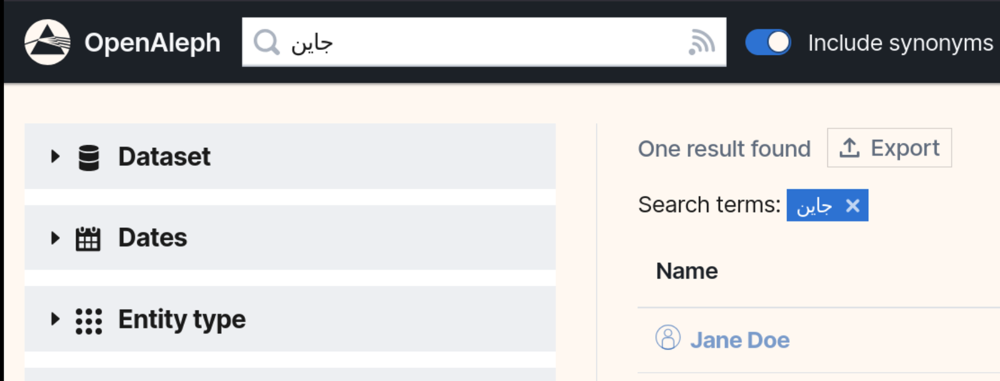
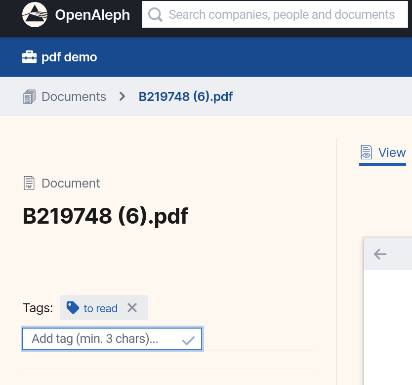

# OpenAleph 5.1 Released: Reworked Synonym Search and New Tagging Feature

> We’ve released a minor update to the OpenAleph 5 series packed with bugfixes, performance improvements, and two new features designed to streamline teamwork and enhance name searches across languages, cultural variants, and alphabets.

<!-- more -->

## Improved search for names and their synonyms

We’ve added a small but powerful knob next to the search bar that makes it much easier to find the people and companies you’re looking for: **the synonyms toggle**. When enabled, your search for a name expands to include results that match its known synonyms. For example, a search for “Vladimir” will also return “Владимир” — and vice versa — as well as equivalents in other languages, including non-Latin scripts such as Chinese. These variant spellings respect cultural context, linguistic conventions, and different alphabets.

Earlier versions of OpenAleph could also match variant name spellings, but only in a limited, fixed way. They relied on a [static global list of names and synonyms](https://github.com/alephdata/synonames/) and offered no way to turn this behavior on or off. OpenAleph 5.1 now uses the name-matching logic developed by our friends at [OpenSanctions](https://www.opensanctions.org/), which provides a far more sophisticated approach to handling name synonyms.

Learn more about how name-synonym matching works in [this blog post](https://www.opensanctions.org/articles/2025-06-24-name-matching/). 

## Improved Collaboration with Document Tagging

OpenAleph 5.1 also introduces a new tagging feature that lets users assign tags to documents. Unlike the existing bookmarks feature, these tags are visible to all users who have access to the investigation. This is designed to streamline research workflows. For example, one researcher might tag documents as “to review,” allowing another team member to take over and dive deeper into them. Documents can then be filtered by tag, making it easy to track and organize research progress. 

Note that assigning a tag does not change the document’s contents, and the tag will not appear when the document is downloaded.

## Deployment and Migration Documentation

OpenAleph is open-source software released under the MIT License, so anyone can obtain a copy and run it independently. While this requires some knowledge of service orchestration and security, we have reworked our documentation to help users set up and manage their own OpenAleph instance. Comprehensive deployment and administration instructions are now available [here](https://openaleph.org/docs/dev-admin-guide/101/).

We have also added two new migration guides that explain how to upgrade OpenAleph [3.X](https://openaleph.org/docs/dev-admin-guide/103/upgrade-3x/) and [4.X](https://openaleph.org/docs/dev-admin-guide/103/upgrade-4x/) to the latest 5.1 version. These guides are also useful for migrating a self-deployed Aleph instance (based on the open-source code **discontinued** by OCCRP) to the latest OpenAleph release.

As always, feel free to reach out with questions or feedback about OpenAleph on our Discourse forum: [darc.social](https://darc.social/).
