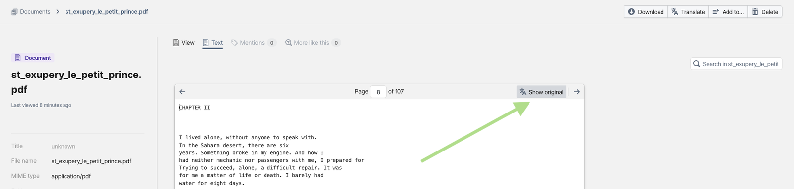
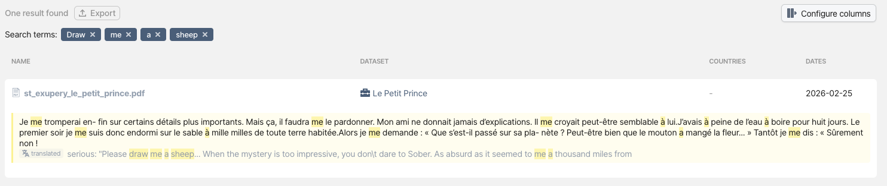
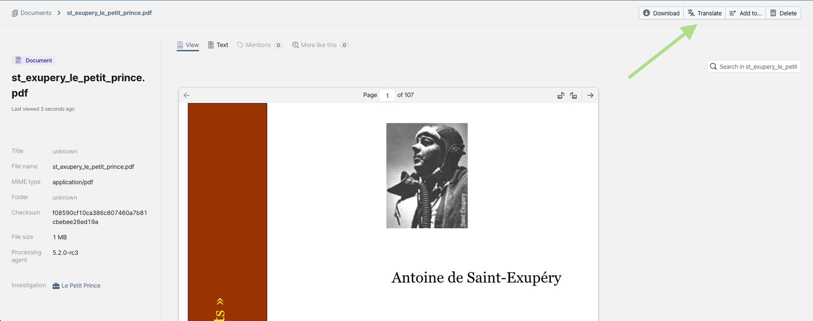

# In-Platform Translation for Sensitive Documents

> OpenAleph 5.2 ships with a local translation service

<!-- more -->

Translating documents in OpenAleph has been a long-requested feature. Previously, translation required taking information out of the platform and sending it through a third-party service, which is not an ideal solution for investigators working with highly sensitive data. It was up to individual investigators or their teams to weigh the risks and benefits. In [version 5.2 of OpenAleph](./2026-03-09-openaleph-5-2-strengthening-email-and-breaking-language-barriers.md), we remove this mental load by offering a translation service that runs inside the software stack.

## Translations in the GenAI Era

Choosing the algorithm for translations was our first difficult task.

Generative artificial intelligence seemed to be the solution most technicians reached for eagerly. However, using genAI for translations exposes users to two notable risks:

1. The model may hallucinate content that did not exist in the source text. One might argue that this can be avoided by setting the model’s “temperature” to 0, provided we run the model ourselves on our own hardware. Still, we must keep that in mind.
2. GenAI models are slower at processing large volumes of data than traditional machine learning models. They require more computational power for the same task and have overall higher energy consumption. Because OpenAleph is designed to operate on large quantities of data, we prefer algorithms that perform well at scale.

By design, genAI algorithms are built to generate content. Translation is a different problem altogether, where fidelity to the original text is often more important than how polished the output sounds.

In investigations and research, we prefer a trade-off that gives users translations that are faster and more faithful to the original, rather than ones that merely *sound nicer.*

## Enter [ftm-translate](https://github.com/openaleph/ftm-translate)

Our translation feature stands on the shoulders of giants. We followed the already established workflow of [ElasticSearch Translator](https://icij.github.io/es-translator/), published by the [International Consortium of Investigative Journalists](http://icij.org/). This implementation uses two different machine learning models:

1. [argos-translate](https://github.com/argosopentech/argos-translate), a Python library based on the [OpenNMT](https://opennmt.net/) open-source neural machine translation system.
2. [Apertium](https://wiki.apertium.org/wiki/Main_Page), which provides rule-based machine learning translation and doesn't rely on statistical or neural methods.

By default, `ftm-translate` uses `argos-translate`. 

Users who deploy OpenAleph themselves can switch between the two models by rebuilding the Dockerfile for the translation service:

```bash
docker build --file Dockerfile --target argos -t ftm-translate 
```
or 

```bash
docker build --file Dockerfile --target apertium -t ftm-translate
```
We also published [prebuilt Docker images](https://github.com/openaleph/ftm-translate/pkgs/container/ftm-translate) for each model, available as `latest-argos` or `latest-apertium`.

## The user interface

OpenAleph must first detect the source language of a document before it can translate it. This happens during the `analyze` step of the ingestion process. The language is inferred using the [FastText](https://fasttext.cc/) Python library and stored in the [Document](https://followthemoney.tech/explorer/schemata/Document/) FollowTheMoney entity under the `detectedLanguage` property.

The target language is configured for the entire OpenAleph instance. By default, this is English (which we use in our [own deployment](https://search.openaleph.org/)). After a document has been translated, a button appears in the Text view of the document. Clicking this button cycles between the original text and the translation.



When a user downloads a document from OpenAleph, the translations are not included. However, they are stored in the corresponding FollowTheMoney entities. These entities can be downloaded via API calls, the [built-in command-line utility](https://github.com/openaleph/openaleph/blob/main/aleph/manage.py#L936), or directly from the database using a helper library such as [ftmq](https://github.com/dataresearchcenter/ftmq).

Translations also enable searching for keywords or phrases in both the original and target languages. In search results, translated text is displayed separately from the original.



## Making the most of ftm-translate

Translating every document uploaded to OpenAleph can be time-consuming. For this reason, translations are customizable. Instead of translating everything automatically, users can disable global translation and translate documents individually using a button in the UI.



An OpenAleph instance can enable both global and per-document translation, or only one of the two.

To translate every uploaded document automatically, set the following environment variables in the relevant containers (identified by service name, as in [docker-compose.example.yml](https://github.com/openaleph/openaleph/blob/main/docker-compose.example.yml)):

```yaml
analyze:
	image: ghcr.io/openaleph/ftm-analyze:${ALEPH_TAG:-latest}
	...
	environment:
		FTM_TRANSLATE_TARGET_LANGUAGE: en
    	OPENALEPH_TRANSLATE_DEFER: 1

translate:
    image: ghcr.io/openaleph/ftm-translate:latest-argos
    command: procrastinate worker -q translate
    depends_on:
      - postgres
    restart: unless-stopped
    environment:
		FTM_TRANSLATE_TARGET_LANGUAGE: en
```

To allow users to translate documents individually, pair the above with:

```yaml
api:
	image: ghcr.io/openaleph/openaleph:${ALEPH_TAG:-latest}
	...
	environment:
		FTM_TRANSLATE_TARGET_LANGUAGE: en
    	OPENALEPH_TRANSLATE_DEFER: 1  

translate:
    image: ghcr.io/openaleph/ftm-translate:latest-argos
    ...
    environment:
		REDIS_URL: ...  
```

If you prefer a different translation model and want to upload translations instead of using `ftm-translate`, you can add translated text directly to the FollowTheMoney entities. We plan to publish a more detailed technical post on this process. For now, the [translation job implementation](https://github.com/openaleph/ftm-translate/blob/main/ftm_translate/tasks.py#L32) can serve as a guide for which entities to create and how to attach translated text so it remains searchable.

The target language should be specified using [ISO 639 language codes](https://en.wikipedia.org/wiki/List_of_ISO_639_language_codes).

You can also install `ftm-translate` locally as a Python package:

```bash
pip install ftm-translate[argos] # or [apertium]
```

or by running:

```bash
git clone git@github.com:openaleph/ftm-translate.git
poetry install --with argos
```

Users installing from source on macOS should ensure their Python version is compatible with [available torch versions](https://pypi.org/project/torch/#files) (a dependency of `ftm-translate`).

The project [README](https://github.com/openaleph/ftm-translate/tree/main?tab=readme-ov-file#cli-usage) lists command-line examples for translating FollowTheMoney entities or plain text. For instance, to translate source text easily from one language to another, run:

```bash
echo "Hallo Welt" | ftm-translate text -s de -t en
```

## Future work

Currently, the original language of each document is detected automatically using the [ftm-analyze](https://github.com/openaleph/ftm-analyze/) library. We’re exploring alternative detection algorithms that could further improve the accuracy of language tagging, helping ensure documents are correctly identified and translated.

In future releases, we plan to add more flexibility to the user interface, including the ability to queue entire collections for translation. We also aim to give users more control by allowing them to manually set the language of individual documents, as well as define a default language for a collection that can guide the translation process.

We warmly invite you to [share feedback](https://darc.social/) on this feature and let us know how it can be improved.
