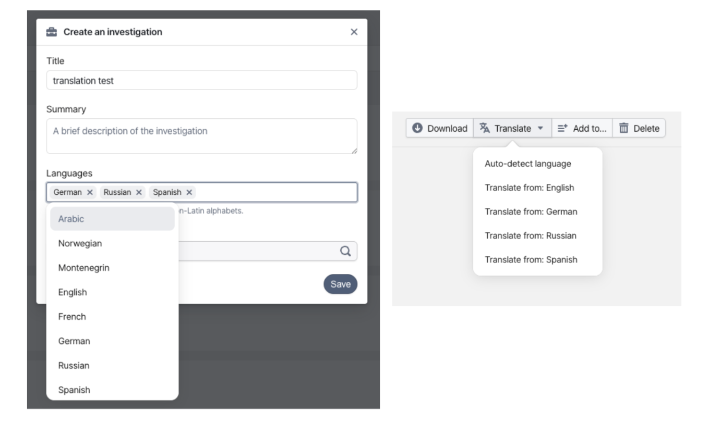

# OpenAleph 5.2.1: Taking Translations a Step Further

> This minor release improves the document translation feature. OpenAleph now allows users to set the source language for a document, and language detection is more efficient as well. 

<!-- more -->

[OpenAleph 5.2](./2026-03-09-openaleph-5-2-strengthening-email-and-breaking-language-barriers.md) introduced translations, a feature that has been in high demand. In its initial implementation, [the translation feature](./2026-03-09-in-platform-translation-for-sensitive-documents.md) allowed users to translate a document from the language OpenAleph detects during ingestion into a target language of their choice.

In practice, data is often messier. A single document can contain text in multiple languages. To support a more robust implementation, we’ve improved the language detection code and added a drop-down menu that lets users choose which language they want to translate from.

During language detection, the text within a document is divided into chunks, and the language of each chunk is identified individually. If the detection reaches a high enough confidence score, that language is added to the `detectedLanguage` property. This makes it much more likely that multilingual documents will include multiple languages in the `detectedLanguage` list.

Because detection isn’t perfect, we’ve gone a step further and allowed users to set the original language manually. If a user adds multiple languages for an entire collection, all of these will be available as source language options in the translation drop-down for documents in that collection.

The target language for translations is configured for the entire OpenAleph instance. This means users can choose which language to translate from, but the target language remains the same across all investigations. Administrators can change the target language by updating the `FTM_TRANSLATE_TARGET_LANGUAGE` environment variable in the following services: `api`, `ftm-analyze`, `ftm-translate`. 

Automatic translations, which can be enabled during ingestion, assume that the source language is defined by the `FTM_TRANSLATE_SOURCE_LANGUAGE` environment variable. [Our blog post](https://openaleph.org/blog/2026/03/In-Platform-Translation-for-Sensitive-Documents/38401cf3-2455-4b0f-a8ea-95e38b97b2f2/) on the translation feature provides more details on how to set up automatic translations.

OpenAleph 5.2.1 also introduces a new command that can be run inside a container built from the [OpenAleph image](https://github.com/openaleph/openaleph/pkgs/container/openaleph), allowing users to delete existing translations. The `delete_translation` command can remove all translations from all documents within a collection, or selectively remove translations from specific entities provided via a file or directly in the command.

This update brings more flexibility and control to translations, making it easier to work with complex, multilingual data in real-world investigations. We hope it helps!
