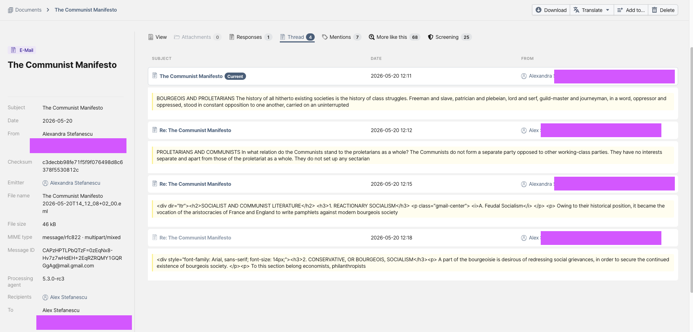
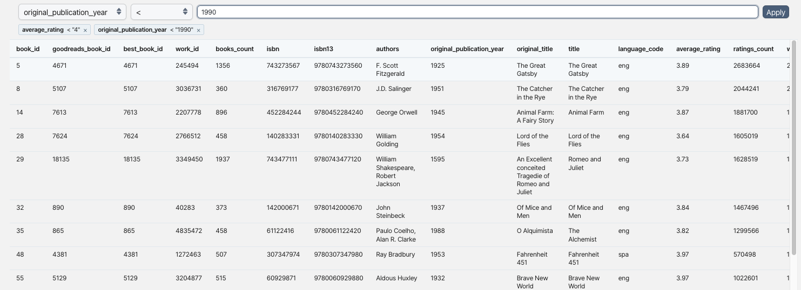
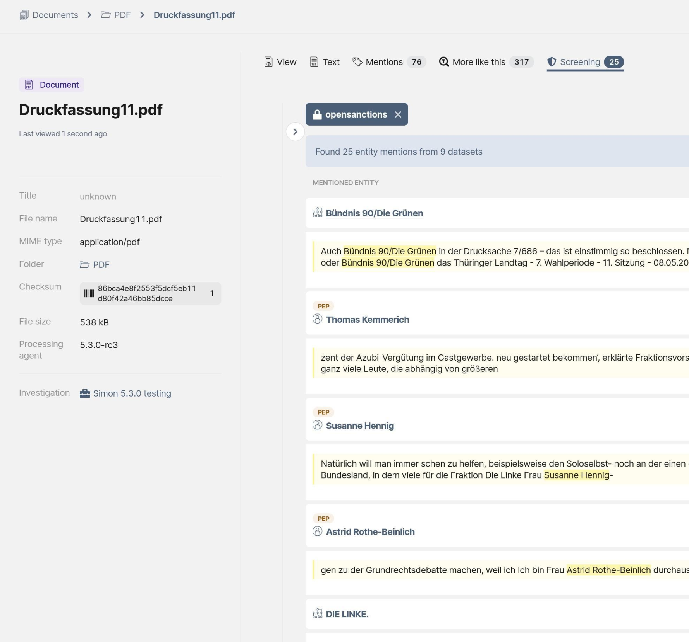

# OpenAleph 5.3: Email threads, Table exploration and Entity Screening

> Our newest release includes three new features for researchers and many small bugfixes and improvements.

<!-- more -->

With version 5.3, OpenAleph added long-awaited features that make e-mails and tables more legible at a glance. We could have wrapped up the release there, but the team snuck in one more feature, something that offers a glimpse of a powerful new way to explore data that we're building into the software.

## E-mails of the world, unite (into a thread)!

OpenAleph has finally joined the ranks of software that can display e-mails as conversations rather than isolated messages.

Researchers have always been able to see that one e-mail was sent in response to another. What OpenAleph lacked was a way to view an entire conversation in one place. Now, the UI can display all e-mails belonging to the same thread together, making it much easier to follow the flow of a discussion.

Threads can only be rendered if OpenAleph contains all of the individual e-mails in the conversation. If only a single e-mail from a thread is uploaded, that e-mail remains searchable and available in OpenAleph, but the thread view itself cannot be generated.

Other improvements make e-mails easier to search, filter, and review in OpenAleph 5.3:

- The metadata for each e-mail now includes the timestamp as well as the date.
- E-mails open in a side tab, just like other document types, allowing researchers to quickly scan contents without losing their place.
- Minor bug fixes have improved how headers are parsed and rendered. We still encounter malformed headers "in the wild" that occasionally make us reconsider our life choices.

These improvements would not have been possible without the open-source code contributions of [Till Prochaska](https://github.com/tillprochaska).

## A table viewer that just makes sense

The way tables used to look in OpenAleph wasn't exactly our pride and joy. We've all been there: a table with thousands of rows shows up in a search result, but there's no easy way of finding where your search term actually appears. Thanks to a substantial open-source contribution from our very own [Jan Strozyk](https://github.com/jlstro), that has changed.

Table entities now include an "**Explore**" tab in their detailed view. This section allows users to search and filter data within tables using intuitive queries, such as comparing values against a reference value or including and excluding specific words in specific columns. For broader exploration, users can also perform a full-text search across the entire table.

CSV files, despite the name, are not always separated by commas. The "**Explore**" tab allows users to change the delimiter used to parse a file, instantly reprocessing the table. This comes in handy when the creators of tabular data have made less-than-orthodox separator choices.

Column headers can also be tricky. Sometimes the row containing column names is not actually the first row in a file. In those cases, users can choose to skip any number of rows in the "**Explore**" tab, ensuring that the correct header row is used when analyzing the table.

One of the most widely used features of OpenAleph is transforming a table into structured [FollowTheMoney](https://followthemoney.tech/) data. Before doing that, however, researchers often need to understand what a table actually contains. Column names may be vague, misleading, or missing altogether. The **"Explore"** tab makes it easy to inspect the data, understand what each column represents, and identify the fields that matter before committing to generating potentially hundreds or thousands of entities.

## Percolation, a brave new world

Imagine you have an OpenAleph dataset containing *Person* entities and the assets they own. You also have a collection of news articles mentioning people involved in money laundering. You want to discover whether any of the people named in those articles already exist in your dataset and, if they do, what information is available about their assets and connections.

Until now, answering that question often meant constructing long and complex queries. OpenAleph 5.3 introduces a different approach.

Traditionally, OpenAleph search starts with a query and answers the question: "Which documents contain these words?" Percolation turns that approach on its head. Instead of searching the data, users can upload a document and have OpenAleph search the document against the data.

In the "**Screening**" tab, users can see all existing FollowTheMoney entities that match names mentioned in the uploaded text. This makes it possible to quickly identify people, companies, assets, and other entities already present in a collection, even in unstructured data such as reporting, leaked documents, or other text sources.

Percolation is not enabled by default. Maintainers of self-hosted OpenAleph instances can enable it by [following our documentation](https://openaleph.org/docs/lib/openaleph-search/percolation/). Our flagship instance already has the feature enabled and allows anyone, even without logging in, to see it in action.

We've also [published a technical deep dive](./2026-06-29_OpenAleph-percolation.md) into how percolation works. More importantly, it explores where this technology can take OpenAleph next. Percolation lays the foundation for a new generation of investigative workflows, where documents and datasets can be connected automatically, helping researchers uncover relevant information with far less manual effort.
