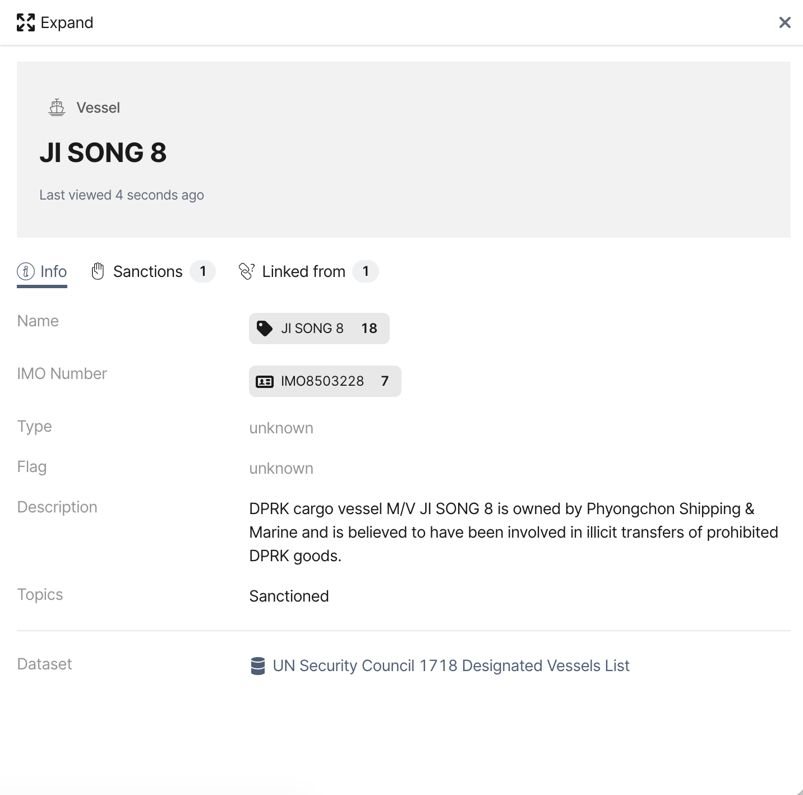
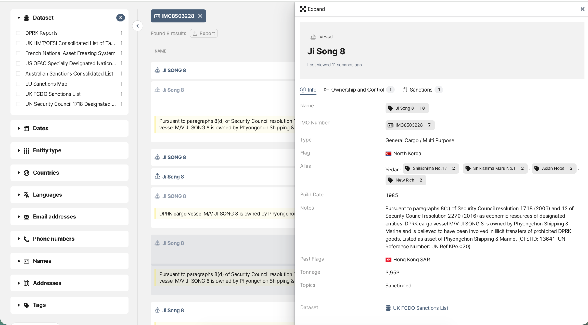
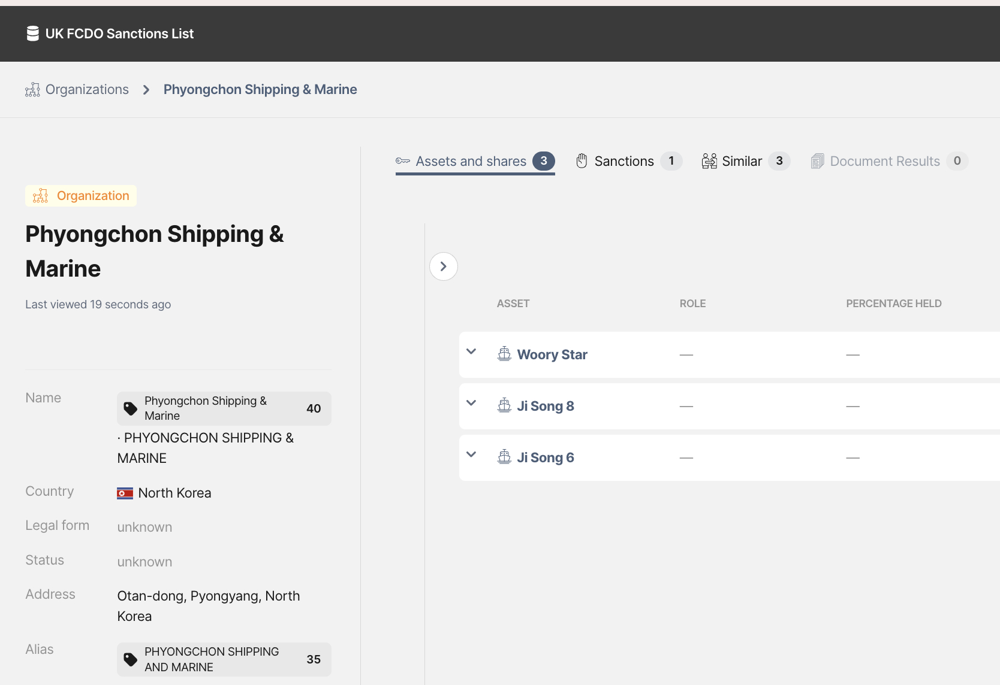
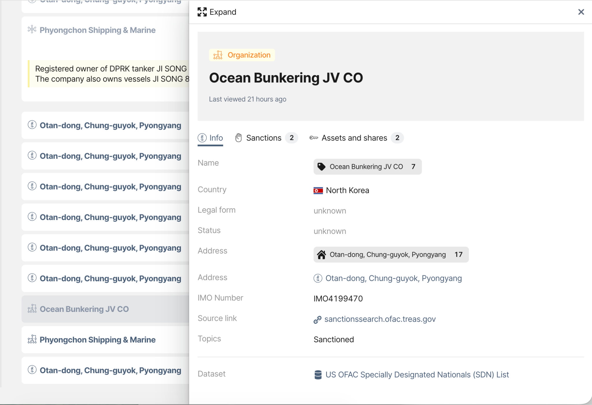
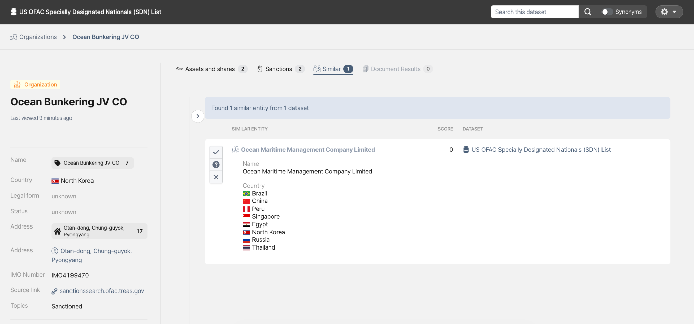

# Exploring OpenAleph: A Practical Guide to Investigations

> Starting with a single sanctioned vessel, we follow the connections to uncover a wider network and show how OpenAleph helps researchers find leads and make connections across datasets.

<!-- more -->

Welcome to the first in a series of posts showing some of the things you can do with OpenAleph.

We thought the easiest way to explain it was to actually play around with some examples. So, over the next few weeks, we'll take on a few different mini investigations and walk through how we'd approach them using OpenAleph. Along the way, we'll show you some of the different features and hopefully give you a better feel for how they can help you follow a lead.

One important thing to keep in mind: **OpenAleph is the software, not the dataset**. It's an open source research platform that can be populated with whatever data you need, allowing you to search, connect, and cross-reference information across datasets.

The [public version of OpenAleph](https://search.openaleph.org/) that we maintain is filled with a large collection of reference datasets that we make available to anyone who wants to search them. Our premium offering **OpenAleph Team** lets newsrooms and research teams upload their own data into our platform and investigate it alongside those reference datasets. Alternatively, organisations can **set up and run their own version of OpenAleph** using the open-source software. We can also provide [hosting and management as a service](https://openaleph.org/managed/#what-we-offer), so teams don't have to worry about setting it up and maintaining it themselves.

For our first example, we'll play the role of a researcher tracking ships involved in North Korean smuggling activities, using the reference datasets available in our public version of OpenAleph.

Let's say we want to find the owner of a ship: **Ji Song 8**.

We type the name into OpenAleph.

The first match is in a UN dataset of sanctioned vessels, provided by [OpenSanctions](https://www.opensanctions.org/). It tells us that Ji Song 8 is tied to the North Korean entity **Phyongchon Shipping & Marine**, and was believed to be involved in smuggling sanctioned North Korean goods.

That's useful, but the dataset doesn't tell us much more. So we follow the vessel into the other data available in OpenAleph.

### Following an identifier

Clicking on Ji Song 8's identification number, or IMO number, takes us to other mentions of the same vessel in our data library.

A UK sanctions dataset, also provided by OpenSanctions, gives us several pieces of information that weren't in the UN record. We learn that Ji Song 8 has sailed under several names, including **Asian Hope** and **New Rich**. We also find details we didn't know we were looking for, such as its 1985 build date and the fact that it sailed under a Hong Kong flag.

A ship's name isn't always a reliable identifier. Ships change names, and different datasets may refer to the same vessel in different ways. The IMO number lets us connect those records and build a fuller picture of the vessel.

And that's one of the perks of using OpenAleph: you don't have to know exactly what you're looking for before you start. You can follow the identifiers and relationships you discover along the way.

### From the ship to its owner

Now let's shift our focus from Ji Song 8 to its owner, Phyongchon Shipping & Marine.

The **Ownership and Control** panel confirms that Phyongchon Shipping & Marine is the owner. Clicking on the company name shows that the UK dataset contains more information than the UN record: the same company is listed as owning several other ships.

So our original question, *Who owns Ji Song 8?*, has already turned into another one: *What else does this company own?*

But we can follow another identifier too.

Clicking on Phyongchon Shipping & Marine's address takes us to **Ocean Bunkering JV CO**, another sanctioned company that shares the exact same address. Ocean Bunkering isn't mentioned in the UK sanctions dataset we started with, but it appears in the US OFAC sanctions dataset.

Because both datasets are available in OpenAleph, we can move between them using a shared piece of information: the address.

This is where having multiple datasets in one place becomes particularly useful. We aren't just searching one list after another. We can use identifiers such as names, addresses and IMO numbers to connect information across different public sources and gradually build out a network.

### Finding things we weren't looking for

The **Similar** panel takes us in yet another direction.

OpenAleph can identify entities and documents that are similar to the one you're looking at, including things that aren't the same entity at all but share enough attributes to be worth a closer look.

The function isn't magic, and it isn't probabilistic. It uses deterministic algorithms to surface entities or documents that resemble the one we're looking at. The more attributes two entities or files have in common, the more likely they are to appear as a result.

Importantly, **Similar** doesn't tell us that two things are connected. It gives us something to investigate. The researcher decides whether the similarity is meaningful.

In this case, one suggestion for Ocean Bunkering JV CO is another company in the US sanctions dataset: **Ocean Maritime Management Company Limited**.

The overview shows that it was also sanctioned for its connection to North Korea and that it owned or operated at least eight ships.

And we could keep going.

We weren't searching for Ocean Maritime Management Company Limited. We got there by following a similarity from a company that shares an address with the owner of Ji Song 8\.

If we were mapping similar cases of sanctions evasion, that's a pretty useful lead.

And that's really the point of this exercise. We started with a very simple question:

**Who owns Ji Song 8?**

A few clicks later, we're looking at:

**Ji Song 8 → its IMO number → its owner → the owner's other vessels → another company sharing its address → another sanctioned company → the ships it owns or operates**

OpenAleph hasn't told us what any of this means. It has helped us find the connections, inspect the underlying data, and decide where we want to go next.

### What about AI?

At this point, we had a pretty good picture of Ji Song 8 and its connections. So we asked Claude the same question we'd started with: *"Who owns Ji Song 8 and what are the relevant connections?"*

The answer was useful. It produced a convincing summary and surfaced several of the same connections we'd found through OpenAleph. But it also missed some of the details we'd uncovered along the way, including Ji Song 8's former names, its Hong Kong flag, and the connection to Ocean Bunkering through the shared address.

More importantly, the answer gave us a conclusion, rather than a way to investigate it. We couldn't easily see how the different pieces of information connected, what other records might be relevant, or what leads we could follow from there.

We also ran the same prompt twice and got different answers, even though the underlying sources hadn't changed.

That's the difference between asking an AI assistant to tell us what it thinks is relevant and doing the research ourselves. The AI has already made a series of decisions about which information matters and how the pieces fit together. With OpenAleph, those decisions stay with the researcher.

We can see the underlying records, follow an IMO number to another dataset, click through an address to find another company, or use a similarity as a new lead. We can check where each piece of information came from and decide for ourselves whether a connection is meaningful.

In other words, OpenAleph isn't trying to give us the answer to *"Who owns Ji Song 8?"* It's helping us get from that question to the next question, and the one after that.

And that's what made the difference in this investigation. We didn't just end up with a summary of what was already known about Ji Song 8. We built a path through the evidence and found connections we hadn't been looking for when we started.

In the next post, we'll switch from ships and sanctions to a different kind of investigation: a leak of emails and documents from the Italian spyware company Hacking Team. There, we'll look at what happens when the connections between pieces of information are themselves part of the evidence.