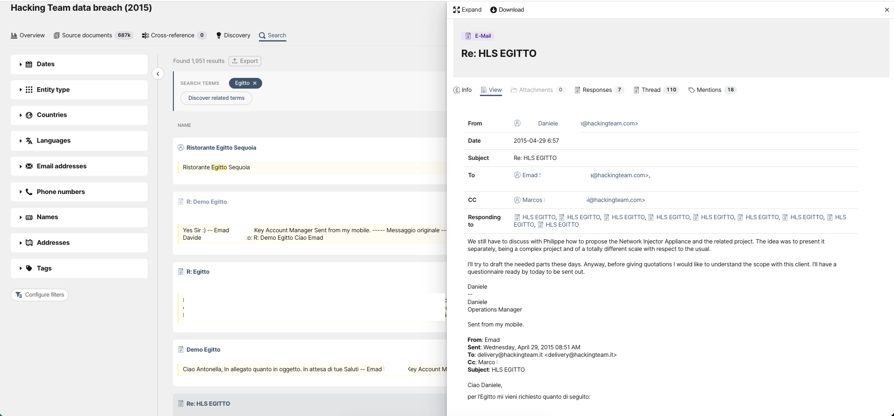
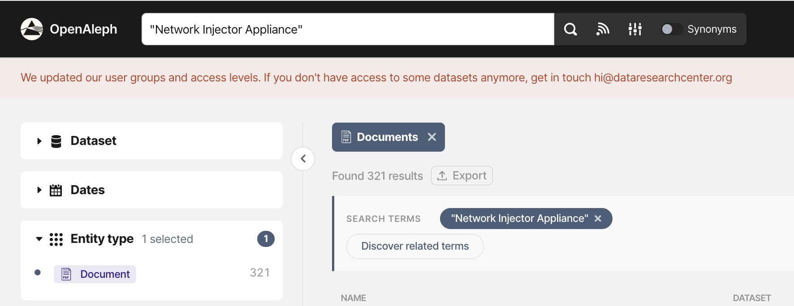
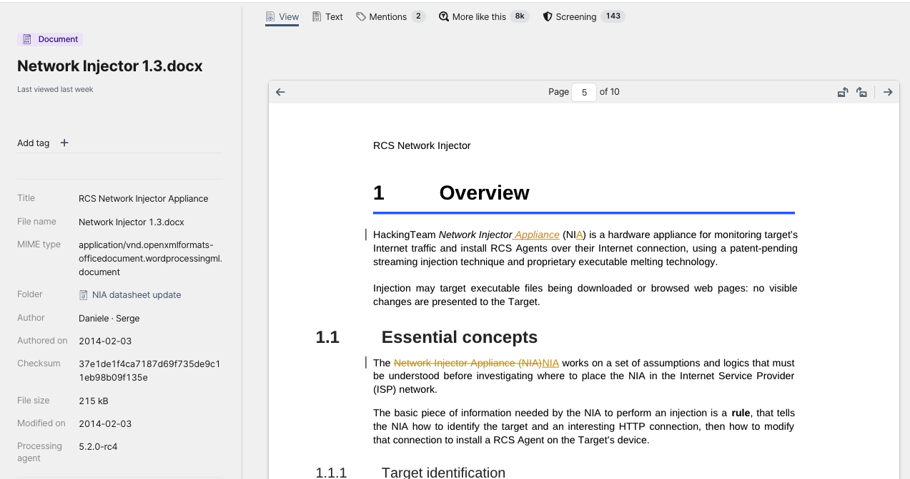
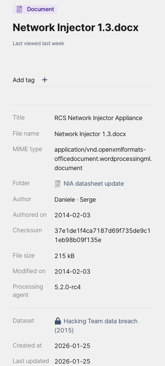
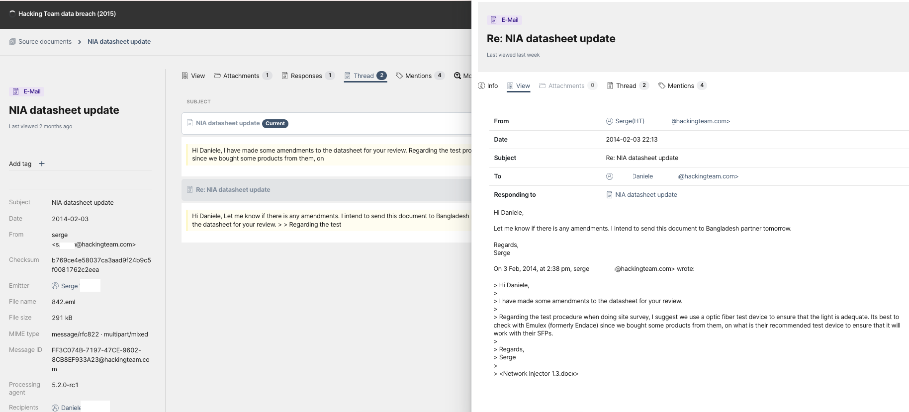
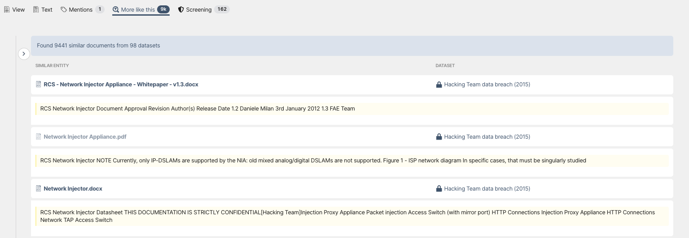
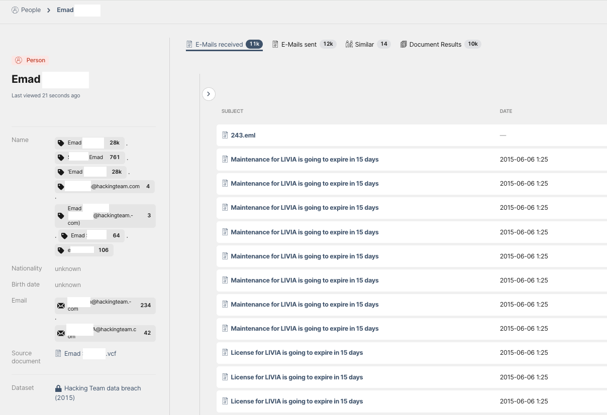

# Context is evidence: investigating a leak with OpenAleph

> This time, we’re tracing people, products and potential customers through a 250GB leak from Hacking Team.

<!-- more -->

In the [previous post](https://openaleph.org/blog/2026/exploring-openaleph-a-practical-guide-to-investigations/), we followed a ship through several datasets, moving from Ji Song 8 to its owner, its other vessels and eventually to another sanctioned company and its ships.

This time, we’re working with a very different kind of data: a 250GB leak of emails and internal documents from the Italian spyware company **Hacking Team**, which developed and sold intrusion and surveillance software to governments around the world. The leak was provided by our friends at [Distributed Denial of Secrets](https://ddosecrets.org/article/hacking-team).

The question isn’t just what these documents contain. It’s what we can learn by examining how they relate to one another.

### Start with a search

Let’s imagine the leak has just landed on our desks. We’ve discussed our needs with the DARC team, uploaded the data to OpenAleph and waited for it to be processed. Now we’re ready to start.

We begin with a simple question: can we find references to a particular country?

We search for **“Egitto,”** Italian for Egypt.

Almost 2,000 results appear, including entities, emails and other documents. One of the first useful results is an email thread with the subject **“Re: HLS EGITTO.”** It shows that Hacking Team was presenting a pitch for Egypt’s Home Land Security authorities:

> “We still have to discuss (...) how to propose the Network Injector Appliance and the related project.”

By clicking on **Thread** in the email panel, we can navigate the conversation and reconstruct it without sorting through individual messages one by one.

The replies indicate that Egyptian authorities were actively requesting Hacking Team’s products and that the Egyptian Armed Forces was already a client. Several contracts were under discussion, with values reaching up to €1.6 million. The thread also mentions potential customers in Lebanon, Kuwait and Jordan.

We now have a clearer picture of Hacking Team’s activity in Egypt, as well as a product name to investigate: **Network Injector Appliance**.

### From an email to a product document

To figure out what it is, we search the term exclusively in *documents* using the filters in OpenAleph. Our thinking is that the leak may contain a brochure, presentation or technical document describing the product.

We immediately find a document titled “RSC Network Injector Appliance Datasheet” describing the product as:

> “a hardware appliance for monitoring target’s Internet traffic and install RCS \[Remote Control System\] Agents over their Internet connection (...). Injection may target executable files being downloaded or browsed web pages: no visible changes are presented to the Target.”

The document explains how the technology was designed to compromise devices through their internet connections. It also raises new questions: where did the document come from, who received it and how was it used?

To answer those questions, we need to look beyond the document’s contents.

### Don’t lose the context

A document is rarely just a document. It may be an attachment to an email, sent by a particular person to a particular recipient at a particular time. The same file may appear in several contexts, under different names or in different versions.

OpenAleph preserves those relationships and makes them searchable.

The Network Injector document we found shows track changes and appears to be a draft, so we inspect its metadata. OpenAleph shows information such as the author, modification date, location in the leak and whether the file was attached to an email.

Here, the metadata shows that the document was attached to an email sent to Daniele, another Hacking Team employee involved in the original Egypt thread. It was being re-worked before being sent to a partner in Bangladesh.

This detail alone gives us a new lead: the location of another potential customer.

### More Like This

Once we find a useful document, we can search for related material without knowing exactly what it's called.

The **More Like This** function surfaces documents with similar content, including files with different names and formats. 

Among the results is another version of the Network Injector document: a final PDF sent as an email attachment four days later, now ready for an upcoming demo for the Dhaka Metropolitan Police in Bangladesh. 

By following the document’s metadata and related files, we can trace how Hacking Team’s sales material changed, where it travelled, and which potential customers were interested in which specific products.

**More Like This** can also help connect the leak to other datasets. For example, if our OpenAleph instance included public tender records and a Hacking Team product appeared in them, **More Like This** could surface those records and give us another lead on the company’s clients.

The feature doesn’t interpret the documents for us. It helps us find related material that may be worth examining.

### Follow people as well as documents

So far, we’ve identified potential customers in Egypt and Bangladesh and traced how Hacking Team’s sales material circulated. We’ve also encountered two key actors: Emad and Daniele.

OpenAleph makes overview pages for people, bringing together emails they’ve sent and received, documents they’re mentioned in and even name variations. Looking at Emad’s entity overview gives us a sense of his activity: roughly 12,000 emails sent and tens of thousands of mentions across the leak.

Among his emails, one subject stands out: **“Malta secret service.”**

The message describes a potential demonstration of Hacking Team’s surveillance software for Malta’s intelligence service.

Using entity recognition, OpenAleph identifies the names of people, places and contacts it can recognize and collects them in the **Mentions** tab. There, you can see where those entities appear elsewhere in the same dataset or in any other dataset you have in your OpenAleph instance.

In this case, Emad included the email address of a Maltese government official who had expressed interest in their products, and now we can follow that identifier to see where else it appears.

Following these mentions reveals attempts to make contact, several undeliverable messages, and records indicating that the person remained in Hacking Team’s contact lists as a potential client who had either not responded or could not be reached.

The deal may not have progressed, but the records show that Maltese authorities had at least expressed interest in Hacking Team’s technology.

### Follow the evidence

In the previous post, we saw how a simple question about a ship led us through identifiers, ownership records, shared addresses and related entities. This investigation follows a different kind of trail: from a country name to an email, from an email to a product, and from that product to potential customers.

The data is different, but the approach is the same. Start with what you have, whether that’s a name, email address, document or other identifier, and use the connections between records to build out the picture. Metadata, similar documents and other datasets can all add context along the way.

That’s the kind of research OpenAleph is built to support. Sometimes the records will confirm what you already suspected. Sometimes they’ll take you somewhere completely unexpected. And sometimes, while looking for an answer to one question, you’ll uncover something else worth investigating.