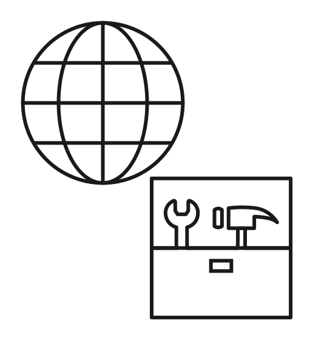

<section class="screen screen--bg-green" data-background-color="green" markdown>

{.no-border style="aspect-ratio:1/1"}

# Managed OpenAleph

Any organization and research team can have its own exclusive and independent instance of OpenAleph. We operate and manage it all for you.

[Get a quote](mailto:hi@dataresearchcenter.org){.btn .btn--primary}

## What we offer

Since 2020, we have deployed exclusive and independent instances of the research platform for investigative newsrooms and research organizations. We take care of everything that might otherwise slow you down, including security, backups, maintenance, and support, so you can focus on finding what you're looking for. . 

We ensure secure and legally compliant deployments. We operate our own physical server infrastructure in Germany, and through our partnership with [FlokiNET](https://flokinet.is), we can also tailor the server location to meet your specific needs. Because we operate our own hardware, our infrastructure is significantly more cost-effective than typical cloud providers.

## What's included

- Managed, secure research infrastructure, exclusively deployed and adapted to each client's needs
- Regular security audits
- Server location in Germany or via [FlokiNET](https://flokinet.is) in Romania, Finland, the Netherlands, or Iceland
- Fully encrypted data and operating system (at rest)
- Nightly backups and storage replication
- Security and maintenance updates
- Temporary upscaling of ingestors for huge leak imports
- DDoS protection
- Secure login with with Multi-Factor Authentication, or connect your own SSO
- Group, user, and permission management
- Optional integration with your VPN
- Ongoing development of new features
- Leak ingestion on our own secure infrastructure

On top of that, we also offer the following services:

- Building and maintaining data projects, from data scraping to analysis and design
- Developing tools for data engineering
- Finding and implementing technical solutions to unique problems that may arise in data-driven investigations
- Consulting and training on data research, engineering, and security in the context of investigative journalism
- Assisting with data research and cross-matching to find new leads
- Analyzing (huge) leaks

</section>
