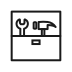

<section class="screen screen--bg-green screen--full-height" data-background-color="green" markdown>

{.no-border style="aspect-ratio:1/1"}

**Managed OpenAleph**

# Get started with OpenAleph

Want an OpenAleph for your entire organization? We can deploy, operate, and manage it for you.

[Learn more](./managed.md){.btn} [Get in touch](mailto:hi@dataresearchcenter.org){.btn .btn--primary}

**Get involved**

# Do it yourself

Clone our repo and get started. If you get stuck, the documentation is here to support you.

[Github](https://github.com/openaleph/openaleph){.btn} [Documentation](https://openaleph.org/docs){.btn .btn--primary}

{.no-border style="aspect-ratio:1/1"}

</section>
